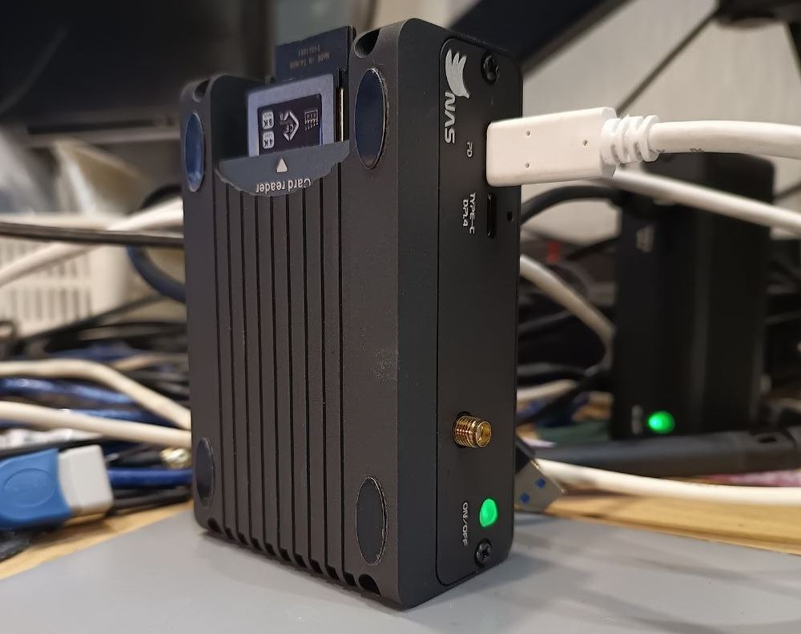

# usb-sync-led – LED indicator for USB Backup on [BananaNAS](https://github.com/sdyspb/BananaNAS) with integrated CFexpress and SD card reader

**usb-sync-led** adds a physical LED status indicator to the `openmediavault-usbbackup` plugin.  
Useful for settin up [BananaNAS](https://github.com/sdyspb/BananaNAS), providing immediate visual confirmation that an automatic USB backup is running.



## Features

- **Red LED** turns on while USB backup is active, turns off after completion.
- **Green system LED** is temporarily disabled during backup – makes red clearly visible.
- **Debounce protection** (2 seconds) prevents flickering on short `rsync` interruptions.
- **Non‑invasive** – monitors the plugin’s process, does not modify any OMV files.
- **Runs as a systemd service** – starts automatically on boot, low CPU overhead.

## Hardware requirements

- [BananaNAS](https://github.com/sdyspb/BananaNAS) with integrated card reader or any SBC with external USB card reader.
- Built‑in **red** (`GPIO4_C5`) and **green** (`GPIO0_B7`) LEDs – already available on BananaNAS.
- OMV with **openmediavault-usbbackup** plugin installed.

## Software prerequisites

- Armbian
- OpenMediaVault
- `openmediavault-usbbackup` – configured backup job
- `openmediavault-resetperms` (recommended – see note about permissions)

## Installation

### 1. Install required OMV plugins

Via OMV web interface → **System > Plugins**:

- `openmediavault-usbbackup`
- `openmediavault-resetperms`

Configure your USB backup job as usual.

### 2. Install the LED indicator script

SSH into your BananaNAS and run:

```bash
git clone https://github.com/YOUR_USERNAME/usb-sync-led.git
cd usb-sync-led
sudo chmod +x install.sh
sudo ./install.sh
```
### 3. Manual installation (if you prefer)
```bash
sudo cp src/usb_sync_led.sh /usr/local/bin/
sudo chmod +x /usr/local/bin/usb_sync_led.sh

sudo tee /etc/systemd/system/usb-sync-led.service > /dev/null <<EOF
[Unit]
Description=USB Sync LED Indicator for BananaNAS
After=multi-user.target

[Service]
Type=simple
ExecStart=/usr/local/bin/usb_sync_led.sh
Restart=always
RestartSec=3
User=root

[Install]
WantedBy=multi-user.target
EOF

sudo systemctl daemon-reload
sudo systemctl enable usb-sync-led.service
sudo systemctl start usb-sync-led.service
```

### Testing
- Manual LED test:

```bash
echo 255 | sudo tee /sys/class/leds/red/brightness   # red on
echo 0   | sudo tee /sys/class/leds/red/brightness   # red off
```
- Simulate a backup – plug a USB drive that triggers your usbbackup job.
The red LED should light up during copying and turn off ~2 seconds after completion. The green LED will be off during that time.

### Security & permissions note
The openmediavault-usbbackup plugin runs rsync as root.
All backed‑up files become owned by root:root with restrictive permissions (read / execute only), that prevents accidental deletion or modification from a regular user.

> To restore normal access 
Use the openmediavault-resetperms plugin. Do not use raw chown/chmod from the command line – that would break OMV’s permission database.

### Built with & credits
- Armbian – Debian for ARM
- OpenMediaVault – NAS web interface
- openmediavault-usbbackup – automatic USB backup engine
- openmediavault-resetperms – safe permission restoration
- Linux LED subsystem – /sys/class/leds/ interface
